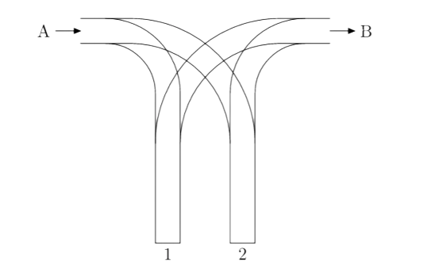

# Railway

Một ga tàu có hai ngã rẽ (ngõ cụt) $1$ và $2$. Tàu đi vào ga từ đường ray $A$ và đi ra ở ray đường $B$ (xem hình minh hoạ phía dưới).



Có $n$ toa tàu đang ở trước đường ray $A$, được đánh số từ $1$ đến $n$. Các toa tàu được sắp xếp sao cho chúng đi vào đường ray $A$ theo thứ tự $a_1, a_2, \ldots, a_n$. Những toa tàu cần được di chuyển vào ga sao cho chúng đi ra ở đường ray $B$ theo thứ tự $1, 2, \ldots, n$. Mỗi toa tàu có thể được di chuyển tới ngã rẽ $1$ hoặc $2$ và sau đó (có thể sau khi di chuyển một số toa còn lại) đi ra ở đường ray $B$. Mỗi ngã rẽ hoạt động như một ngăn xếp, tức là ở mỗi ngã rẽ, khi một toa di chuyển vào nó sẽ đứng đầu ngã rẽ, và mỗi lần chỉ toa đứng đầu ngã rẽ được di chuyển đến đường ray $B$.

## Input format

Dòng đầu tiên một số nguyên dương $n$ ($n\le 1000000$) là số lượng toa tàu.

Dòng thứ hai chứa $n$ số nguyên dương $a_1, a_2, \ldots, a_n$ là thứ tự các toa tàu đi vào ga.

## Output format

Dòng đầu tiên in ra $\texttt{TAK}$ nếu tồn tại một cách di chuyển các toa thỏa mãn yêu cầu và $\texttt{NIE}$ trong trường hợp ngược lại.

Nếu kết quả là $\texttt{TAK}$, dòng thứ hai in ra $n$ số nguyên ($1$ hoặc $2$) là các ngã rẽ mà các toa tàu $a_1, a_2, \ldots, a_n$ lần lượt đi vào. Nếu có nhiểu cách di chuyển, in ra một cách bất kì.

## Sample

### Input

```
4
1 3 4 2
```

### Output

```
TAK
1 1 2 1
```

### Input

```
4
2 3 4 1
```

### Output

```
NIE
```